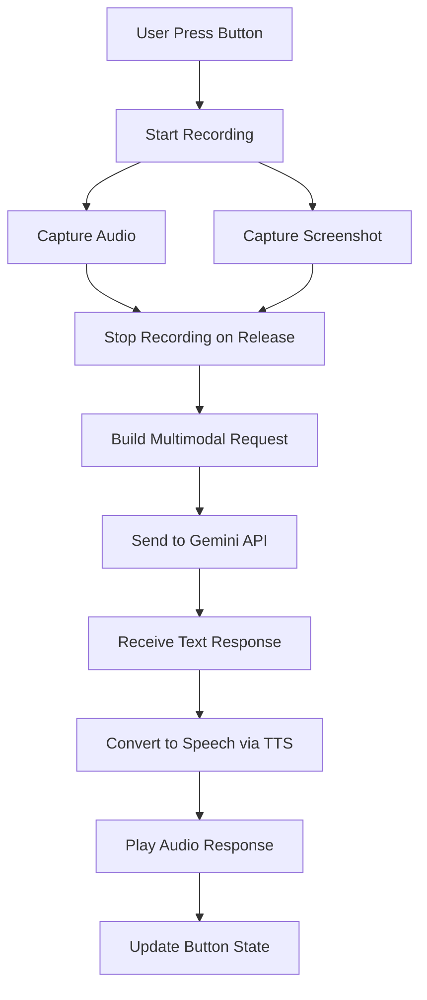

# Gemini AI Voice Interaction Design for QuestCameraTools-Unity

## Table of Contents
1. [Feature Overview](#feature-overview)
2. [Architecture Design](#architecture-design)
3. [Component Specifications](#component-specifications)
4. [Implementation Details](#implementation-details)
5. [UI/UX Design](#uiux-design)
6. [API Integration](#api-integration)
7. [Error Handling](#error-handling)
8. [Performance Considerations](#performance-considerations)

## Feature Overview

The Gemini AI Voice Interaction feature enables Meta Quest users to interact with Google's Gemini AI using voice commands while leveraging the passthrough camera for visual context. This creates a multimodal AI assistant experience within the QuestCameraTools ecosystem.

### Key Features
- **Voice Recording**: Press-to-talk button for voice queries
- **Visual Context**: Automatic passthrough camera screenshot capture
- **Multimodal AI**: Gemini processes both voice and visual inputs
- **Audio Response**: Text-to-speech playback of AI responses
- **Visual Feedback**: Dynamic button states for user awareness

### User Flow
1. User presses the voice button to start recording
2. System captures voice input and passthrough camera screenshot
3. Data is sent to Gemini AI for processing
4. AI response is converted to speech and played back
5. User can interrupt at any time by pressing the button again

## Architecture Design

### Component Hierarchy
```
QuestCameraTools-Unity
├── GeminiVoiceToggle (MonoBehaviour)
│   ├── Visual State Manager
│   ├── Audio Recorder
│   └── Interaction Handler
├── GeminiAPIManager (Singleton)
│   ├── Request Builder
│   ├── Response Parser
│   └── Authentication Handler
├── PassthroughScreenshotCapture (Utility)
│   ├── WebCamTextureManager Integration
│   └── Image Encoder
└── GeminiTTSManager (Service)
    ├── TTS Request Handler
    └── Audio Playback Controller
```

### Data Flow


## Component Specifications

### 1. GeminiVoiceToggle Component

```csharp
namespace QuestCameraTools.App
{
    public class GeminiVoiceToggle : MonoBehaviour, IPointerDownHandler, IPointerUpHandler
    {
        [Header("Visual States")]
        [SerializeField] private Material idleMaterial;      // Microphone icon
        [SerializeField] private Material recordingMaterial; // Active microphone
        [SerializeField] private Material processingMaterial; // Loading spinner
        
        [Header("Audio Settings")]
        [SerializeField] private int recordingFrequency = 44100;
        [SerializeField] private float maxRecordingTime = 30f;
        
        [Header("References")]
        [SerializeField] private Renderer targetRenderer;
        [SerializeField] private AudioSource audioSource;
        
        private enum State
        {
            Idle,
            Recording,
            Processing,
            Playing
        }
        
        private State currentState = State.Idle;
        private AudioClip recordedClip;
        private Coroutine recordingCoroutine;
        private GeminiAPIManager apiManager;
        private PassthroughScreenshotCapture screenshotCapture;
        private GeminiTTSManager ttsManager;
        
        // Core functionality methods
        public void OnPointerDown(PointerEventData eventData);
        public void OnPointerUp(PointerEventData eventData);
        private IEnumerator RecordAudio();
        private void ProcessVoiceQuery();
        private void UpdateVisualState();
        private void PlayResponse(AudioClip responseClip);
    }
}
```

### 2. GeminiAPIManager

```csharp
namespace QuestCameraTools.Gemini
{
    public class GeminiAPIManager : MonoBehaviour
    {
        private static GeminiAPIManager instance;
        public static GeminiAPIManager Instance => instance;
        
        [Header("API Configuration")]
        [SerializeField] private string apiEndpoint = "https://generativelanguage.googleapis.com/v1beta/models/gemini-pro-vision:generateContent";
        [SerializeField] private bool useEnvironmentKey = true;
        [SerializeField] private string apiKeyOverride; // For testing only
        
        private string apiKey;
        private const int MAX_RETRIES = 3;
        private const float TIMEOUT = 30f;
        
        public struct MultimodalRequest
        {
            public byte[] audioData;
            public string audioMimeType;
            public byte[] imageData;
            public string imageMimeType;
            public string textPrompt;
        }
        
        public async Task<string> SendMultimodalRequest(MultimodalRequest request);
        private string BuildRequestJson(MultimodalRequest request);
        private IEnumerator SendRequestCoroutine(string json, Action<string> callback);
        private void HandleError(string error);
    }
}
```

### 3. PassthroughScreenshotCapture

```csharp
namespace QuestCameraTools.Utilities
{
    public class PassthroughScreenshotCapture : MonoBehaviour
    {
        private WebCamTextureManager webCamTextureManager;
        
        public struct ScreenshotData
        {
            public byte[] pngData;
            public int width;
            public int height;
            public DateTime timestamp;
        }
        
        public ScreenshotData CaptureScreenshot()
        {
            if (webCamTextureManager == null || webCamTextureManager.WebCamTexture == null)
            {
                Debug.LogError("[PassthroughScreenshot] WebCamTextureManager not available");
                return default;
            }
            
            var webCamTexture = webCamTextureManager.WebCamTexture;
            var width = webCamTexture.width;
            var height = webCamTexture.height;
            
            // Get pixels from passthrough camera
            var pixels = webCamTexture.GetPixels32();
            
            // Create texture and encode
            var tex = new Texture2D(width, height, TextureFormat.RGBA32, false);
            tex.SetPixels32(pixels);
            tex.Apply();
            
            var pngData = tex.EncodeToPNG();
            Destroy(tex);
            
            return new ScreenshotData
            {
                pngData = pngData,
                width = width,
                height = height,
                timestamp = DateTime.Now
            };
        }
    }
}
```

### 4. GeminiTTSManager

```csharp
namespace QuestCameraTools.Gemini
{
    public class GeminiTTSManager : MonoBehaviour
    {
        [Header("TTS Configuration")]
        [SerializeField] private string ttsEndpoint = "https://texttospeech.googleapis.com/v1/text:synthesize";
        [SerializeField] private string voiceName = "en-US-Neural2-J";
        [SerializeField] private float speakingRate = 1.0f;
        
        public struct TTSRequest
        {
            public string text;
            public string languageCode;
            public string voiceName;
            public float speakingRate;
        }
        
        public async Task<AudioClip> ConvertTextToSpeech(string text);
        private IEnumerator SendTTSRequest(TTSRequest request, Action<AudioClip> callback);
        private AudioClip ConvertBase64ToAudioClip(string base64Audio);
    }
}
```

## Implementation Details

### Audio Recording Implementation

```csharp
private IEnumerator RecordAudio()
{
    string micDevice = Microphone.devices.Length > 0 ? Microphone.devices[0] : null;
    if (string.IsNullOrEmpty(micDevice))
    {
        Debug.LogError("[GeminiVoiceToggle] No microphone found");
        yield break;
    }
    
    currentState = State.Recording;
    UpdateVisualState();
    
    // Start recording
    recordedClip = Microphone.Start(micDevice, false, (int)maxRecordingTime, recordingFrequency);
    float startTime = Time.time;
    
    // Wait while recording
    while (currentState == State.Recording && Time.time - startTime < maxRecordingTime)
    {
        yield return null;
    }
    
    // Stop recording
    Microphone.End(micDevice);
    
    // Trim silence and convert to WAV
    if (recordedClip != null && recordedClip.samples > 0)
    {
        ProcessVoiceQuery();
    }
}
```

### Screenshot Capture Integration

```csharp
private void CaptureContextualScreenshot()
{
    var screenshotData = screenshotCapture.CaptureScreenshot();
    if (screenshotData.pngData != null && screenshotData.pngData.Length > 0)
    {
        // Store for API request
        lastScreenshot = screenshotData;
        Debug.Log($"[GeminiVoiceToggle] Captured screenshot: {screenshotData.width}x{screenshotData.height}");
    }
}
```

### API Request Structure

```csharp
private string BuildMultimodalRequest(byte[] audioData, byte[] imageData)
{
    var request = new
    {
        contents = new[]
        {
            new
            {
                role = "user",
                parts = new[]
                {
                    new
                    {
                        text = "Analyze what you see in this image and respond to my voice query."
                    },
                    new
                    {
                        inline_data = new
                        {
                            mime_type = "image/png",
                            data = Convert.ToBase64String(imageData)
                        }
                    },
                    new
                    {
                        inline_data = new
                        {
                            mime_type = "audio/wav",
                            data = Convert.ToBase64String(audioData)
                        }
                    }
                }
            }
        },
        generationConfig = new
        {
            temperature = 0.7,
            topK = 40,
            topP = 0.95,
            maxOutputTokens = 1024
        }
    };
    
    return JsonUtility.ToJson(request);
}
```

## UI/UX Design

### Visual States

1. **Idle State**
   - Material: `idleMaterial` with microphone icon
   - Color: Semi-transparent white (#FFFFFF80)
   - Behavior: Awaiting user interaction

2. **Recording State**
   - Material: `recordingMaterial` with active microphone icon
   - Color: Recording red (#FF0000)
   - Behavior: Pulsing animation
   - Audio feedback: Recording start beep

3. **Processing State**
   - Material: `processingMaterial` with loading spinner
   - Color: Processing blue (#0080FF)
   - Behavior: Rotating animation
   - Duration: Until API response received

4. **Playing State**
   - Material: `idleMaterial` with speaker icon overlay
   - Color: Playing green (#00FF00)
   - Behavior: Sound wave animation
   - Duration: Until audio playback complete

### Button Prefab Structure

```
GeminiVoiceToggle (GameObject)
├── Button3D (GameObject)
│   ├── MeshRenderer (Component)
│   ├── BoxCollider (Component)
│   └── GeminiVoiceToggle (Script)
├── AudioSource (GameObject)
│   └── AudioSource (Component)
└── VisualFeedback (GameObject)
    ├── PulseAnimation (Animator)
    └── ParticleSystem (Component)
```

## API Integration

### Using UGemini Package

```csharp
// Package installation via manifest.json
{
    "dependencies": {
        "com.uralstech.ugemini": "https://github.com/Uralstech/UGemini.git"
    }
}

// Integration example
using Uralstech.UGemini;

private async void ProcessWithUGemini()
{
    var gemini = new GeminiClient(apiKey);
    
    var request = new GenerateContentRequest
    {
        Model = "gemini-pro-vision",
        Contents = new List<Content>
        {
            new Content
            {
                Parts = new List<Part>
                {
                    new TextPart { Text = "Describe what you see and answer the question" },
                    new InlineDataPart 
                    { 
                        MimeType = "image/png",
                        Data = Convert.ToBase64String(imageBytes)
                    },
                    new InlineDataPart
                    {
                        MimeType = "audio/wav",
                        Data = Convert.ToBase64String(audioBytes)
                    }
                }
            }
        }
    };
    
    var response = await gemini.GenerateContentAsync(request);
    HandleGeminiResponse(response);
}
```

### Authentication

```csharp
private void InitializeAuthentication()
{
    // Priority order for API key
    // 1. Environment variable (recommended for production)
    apiKey = Environment.GetEnvironmentVariable("GEMINI_API_KEY");
    
    // 2. PlayerPrefs (for development)
    if (string.IsNullOrEmpty(apiKey))
    {
        apiKey = PlayerPrefs.GetString("GeminiAPIKey", "");
    }
    
    // 3. Override in inspector (testing only)
    if (string.IsNullOrEmpty(apiKey) && !string.IsNullOrEmpty(apiKeyOverride))
    {
        apiKey = apiKeyOverride;
        Debug.LogWarning("[GeminiAPI] Using override API key - not recommended for production");
    }
    
    if (string.IsNullOrEmpty(apiKey))
    {
        Debug.LogError("[GeminiAPI] No API key found. Please set GEMINI_API_KEY environment variable");
    }
}
```

## Error Handling

### Network Errors

```csharp
private void HandleNetworkError(UnityWebRequest.Result result, string error)
{
    switch (result)
    {
        case UnityWebRequest.Result.ConnectionError:
            ShowError("No internet connection. Please check your network.");
            break;
            
        case UnityWebRequest.Result.ProtocolError:
            var statusCode = GetStatusCode(error);
            if (statusCode == 429)
                ShowError("Rate limit exceeded. Please try again later.");
            else if (statusCode == 401)
                ShowError("Invalid API key. Please check your credentials.");
            else
                ShowError($"API error: {error}");
            break;
            
        case UnityWebRequest.Result.DataProcessingError:
            ShowError("Failed to process response. Please try again.");
            break;
    }
    
    // Reset to idle state
    currentState = State.Idle;
    UpdateVisualState();
}
```

### Audio Errors

```csharp
private void HandleAudioError(string context)
{
    Debug.LogError($"[GeminiVoiceToggle] Audio error in {context}");
    
    // Provide user feedback
    if (context == "recording")
    {
        ShowError("Microphone access denied or unavailable.");
    }
    else if (context == "playback")
    {
        ShowError("Failed to play audio response.");
    }
    
    // Cleanup
    if (recordedClip != null)
    {
        Destroy(recordedClip);
        recordedClip = null;
    }
}
```

### Timeout Handling

```csharp
private IEnumerator RequestWithTimeout(UnityWebRequest request, float timeout)
{
    float startTime = Time.time;
    
    request.SendWebRequest();
    
    while (!request.isDone)
    {
        if (Time.time - startTime > timeout)
        {
            request.Abort();
            HandleTimeoutError();
            yield break;
        }
        yield return null;
    }
    
    // Process response
    if (request.result == UnityWebRequest.Result.Success)
    {
        ProcessResponse(request.downloadHandler.text);
    }
    else
    {
        HandleNetworkError(request.result, request.error);
    }
}
```

## Performance Considerations

### Memory Management

```csharp
public class ResourceManager : MonoBehaviour
{
    private const int MAX_SCREENSHOT_SIZE = 1024; // Max dimension
    private const int AUDIO_SAMPLE_RATE = 16000; // Reduced for smaller files
    
    private byte[] ResizeImageIfNeeded(byte[] originalPng)
    {
        var tex = new Texture2D(2, 2);
        tex.LoadImage(originalPng);
        
        if (tex.width > MAX_SCREENSHOT_SIZE || tex.height > MAX_SCREENSHOT_SIZE)
        {
            // Calculate new dimensions
            float scale = Mathf.Min(
                MAX_SCREENSHOT_SIZE / (float)tex.width,
                MAX_SCREENSHOT_SIZE / (float)tex.height
            );
            
            int newWidth = Mathf.RoundToInt(tex.width * scale);
            int newHeight = Mathf.RoundToInt(tex.height * scale);
            
            // Resize
            TextureScale.Bilinear(tex, newWidth, newHeight);
            var resizedPng = tex.EncodeToPNG();
            
            Destroy(tex);
            return resizedPng;
        }
        
        Destroy(tex);
        return originalPng;
    }
}
```

### Async Operations

```csharp
private async void ProcessQueryAsync()
{
    try
    {
        currentState = State.Processing;
        UpdateVisualState();
        
        // Parallel processing
        var screenshotTask = Task.Run(() => CaptureScreenshot());
        var audioTask = Task.Run(() => ProcessAudioData(recordedClip));
        
        await Task.WhenAll(screenshotTask, audioTask);
        
        // Send to API
        var response = await apiManager.SendMultimodalRequest(new MultimodalRequest
        {
            audioData = audioTask.Result,
            imageData = screenshotTask.Result,
            audioMimeType = "audio/wav",
            imageMimeType = "image/png"
        });
        
        // Convert to speech
        var audioClip = await ttsManager.ConvertTextToSpeech(response);
        
        // Play response
        PlayResponse(audioClip);
    }
    catch (Exception e)
    {
        Debug.LogError($"[GeminiVoiceToggle] Processing error: {e.Message}");
        HandleProcessingError(e);
    }
}
```

### Optimization Tips

1. **Audio Compression**
   - Downsample to 16kHz for voice (reduces file size by 64%)
   - Use mono channel instead of stereo
   - Implement voice activity detection to trim silence

2. **Image Optimization**
   - Resize images to max 1024x1024 before sending
   - Use JPEG compression for non-transparent images
   - Cache processed images for 5 minutes

3. **API Call Batching**
   - Queue multiple requests if rapid-fire usage
   - Implement debouncing for button presses
   - Use connection pooling for API requests

4. **Memory Pooling**
   - Reuse byte arrays for audio/image data
   - Pool UnityWebRequest objects
   - Clear large objects immediately after use

## Integration with QuestCameraTools

### Namespace Structure
```
QuestCameraTools
├── App (existing)
│   ├── AudioToggle.cs
│   └── GeminiVoiceToggle.cs (new)
├── Gemini (new)
│   ├── GeminiAPIManager.cs
│   └── GeminiTTSManager.cs
└── Utilities (extended)
    └── PassthroughScreenshotCapture.cs
```

### Assembly Definition
```json
{
    "name": "QuestCameraTools.Gemini",
    "references": [
        "QuestCameraTools.Core",
        "QuestCameraTools.App",
        "Unity.TextMeshPro",
        "Uralstech.UGemini"
    ],
    "includePlatforms": ["Android"],
    "excludePlatforms": [],
    "allowUnsafeCode": false,
    "overrideReferences": false,
    "precompiledReferences": [],
    "autoReferenced": true,
    "defineConstraints": [],
    "versionDefines": []
}
```

### Prefab Integration
The GeminiVoiceToggle prefab should be added alongside existing UI elements in the sample scenes, maintaining consistency with the current QuestCameraTools UI layout and interaction patterns.

